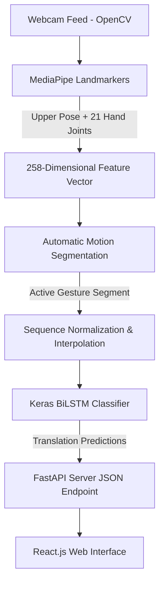

# SignSight V1: Real-Time ASL Gesture Recognition

SignSight V1 is a full-stack computer vision and deep learning sequence classification system. It translates 77 American Sign Language (ASL) vocabulary gestures in real-time from standard webcam streams. 

The system leverages MediaPipe coordinate trackers for feature extraction and passes the sequence of joint lines to a Bidirectional LSTM (BiLSTM) model, executing inference in **~5ms** with thread-safe background workers.

---

## Key Performance Metrics
*   **Vocabulary Support:** 77 everyday ASL words (e.g., hello, good, bye, please, water, work, tomorrow).
*   **Validation Accuracy:** **74.26%** Top-1 Accuracy | **94.88%** Top-5 Accuracy.
*   **Inference Latency:** ~5ms per gesture (offloaded to daemon worker threads).
*   **Performance Rate:** Smooth, lag-free 30 FPS camera tracking.

---

## System Architecture



### 1. Preprocessing & Deep Learning Pipeline (`/Training`)
*   **Skeletal Point Landmark Extraction:** Tracks 33 Pose coordinates and 21 joints per hand to form a 258-dimensional vector (132 Pose + 63 Left Hand + 63 Right Hand).
*   **Automatic Motion Segmentation:** Monitors wrist movement distance velocity. Signing is auto-recorded when hands begin moving, and segment boundaries are established after 8 consecutive resting frames.
*   **Feature Normalization:** Stabilizes predictions by centering coordinates on the hand wrist joints and scaling the pose skeleton relative to the shoulder width. This removes camera distance variance.
*   **Sequence Classifier Model:** Built with a stacked Bidirectional LSTM model with dropout layers, trained with balanced class weights.

### 2. Full-Stack Web Dashboard
*   **FastAPI Backend (`/backend`):** Streams processed frame sequences, manages hardware video capture flags, and handles inference calls.
*   **React Frontend (`/frontend`):** Features a dark UI overlay, interactive dictionary, diagnostic indicators, and settings drawers.

---

## Repository Structure

```text
Sign_Sight_ai/
│
├── backend/                  # FastAPI webcam streaming server
│   └── app.py
│
├── frontend/                 # React web dashboard
│   ├── public/
│   ├── src/
│   ├── package.json
│   └── package-lock.json
│
├── Training/                 # Preprocessing & model training pipelines
│   ├── config.py             # Hyperparameter settings
│   ├── count_videos.py       # Dataset analysis tool
│   ├── V1_01_Dataset_v1_creation.py
│   ├── V1_02_augmentation.py
│   ├── V1_03_extract_Landmakrs.py
│   ├── V1_04_build_dataset.py
│   ├── V1_05_train_model(colab version).py
│   ├── V1_06_evaluate_model.py
│   ├── V1_07_realtime_inference.py
│   └── V1_08_normalize_hands.py
│
├── .gitignore                # Stops large binaries from uploading
├── requirements.txt          # Python dependencies
└── README.md                 # Project documentation
```

---

## Installation & Local Setup

### Prerequisite Checklist
*   Python 3.10+
*   Node.js & NPM
*   Webcam connected to system

### 1. Setup the Python Backend
Clone this project, navigate to the root, and run:
```bash
# Install dependencies
pip install -r requirements.txt

# Start the FastAPI server
uvicorn backend.app:app --host 127.0.0.1 --port 5000
```
*(Note: On initial start, the server will automatically download the required MediaPipe landmarker `.task` binary files).*

### 2. Setup the React Frontend
In a new terminal window, navigate to the `frontend/` directory and run:
```bash
# Install dependencies
npm install

# Start the development client
npm start
```
The application will launch on `http://localhost:3000`.

---

## Dataset Attributions
This model was trained using public sign language datasets. We attribute the authors for their valuable contributions:
1.  **ASL Citizen Dataset (2023):** Sundararaman et al. *"ASL Citizen: A Community-Sourced Dataset for Word-Level American Sign Language Recognition."* Hosted on [Microsoft Research](https://www.microsoft.com/en-us/research/project/asl-citizen/).
2.  **WLASL Dataset (2020):** Li et al. *"Word-Level Deep Sign Language Recognition from Video."* Obtained from the public [Kaggle Dataset](https://www.kaggle.com/datasets/david1013/wlasl-dataset) resource.
